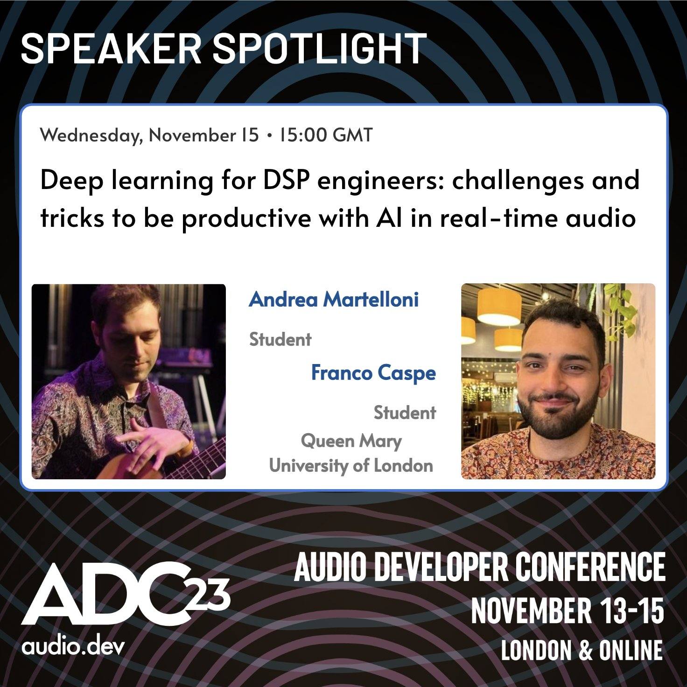

<h2>Abstract</h2>

This talk aims to tackle and demystify the process of the development of an AI-based musical instrument, audio tool or effect. We want to view this process not from the point of view of technical frameworks and technical challenges, but from that of the design process, the knowledge required and the learning curve needed to be productive with AI tools; particularly if one approaches AI from an audio DSP background, which was our situation when we started out.

We are going to quickly survey the current applications of AI for real-time music making, and reflect on the challenges that we found, especially with current learning resources. We will then walk through the process of developing a real-time audio model based on deep learning, from dataset to deployment, highlighting the relevant aspects for those with a DSP background. Finally, we will describe how we applied that process to our own PhD projects, the HITar and the Bessel’s Trick.

## <a href="../assets/DL4DSP.pdf">Download Slides</a>
