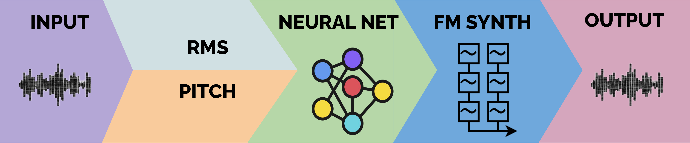

Transform the sound of your instrument using <b>Neural Nets</b> and <b>FM synthesis</b>.
 As you play. <b>In Real Time.</b>

## How does it work? 

**Bessel's Trick** uses **Audio-to-Audio** transformation of musical instrument sounds.  

Under the hood, the plugin extracts features (*RMS*, *Pitch*) from a musical instrument input, and feeds them to a **neural net** that controls an **FM synth**.
We run the nets at **~700 times a second**, providing **minimum latency**.

## Get the Plugin

 - First, choose the package according to your OS.
<table class="center">
<tr>
    <th>
    <a href="https://github.com/fcaspe/BesselsTrick/releases/download/v0.12/BesselsTrick_MacOS_arm64.zip">macOS ARM</a>
    </th>
    <th>
    <a href="https://github.com/fcaspe/BesselsTrick/releases/download/v0.12/BesselsTrick_MacOS_intel.zip">macOS intel</a>
    </th>
    <th>
    <a href="https://github.com/fcaspe/BesselsTrick/releases/download/v0.12/BesselsTrick_Ubuntu.zip">Ubuntu</a>
    </th>
</tr>

</table>

- Next, <a href="https://github.com/fcaspe/BesselsTrick/releases/download/v0.12/PretrainedModels.zip"><b>Download the Pretrained Models</b></a>

Latest update: `22/10/23 - Version 0.12`  

## Instructions

The plugin can be loaded into any DAW (Digital Audio Workstation) that supports VST3 or AU plugin formats.  
Each each **neural net** (called *model*)  works like a synth patch.  
Each **model** implements a new sound you can control with your instrument.

 - <a href="/BesselsTrick#get-the-plugin">Download the plugin</a> into a directory where your <a href="https://higherhz.com/adding-a-new-vst-synth-plugin-to-reaper/">DAW can see it</a>.
 - Download and uncompress the <a href="/BesselsTrick">pretrained models</a>.
 - Open the plugin at your DAW, and press the **(+)** button.
 - Select the folder where you uncompressed the **pretrained models**.
 - **Done!** The models can now be selected from the GUI's list.

## Contact

Your feedback is very valuable! If you and have any comments, feedback or ideas about this project <a href="http://www.eecs.qmul.ac.uk/people/profiles/caspefrancosantiago.html">Contact Me</a>.

## About

This project was developed as part of my PhD at the <a href="https://c4dm.eecs.qmul.ac.uk/">Centre For Digital Music</a> and the <a href="http://instrumentslab.org/index.html">Augmented Instruments Lab</a>.

