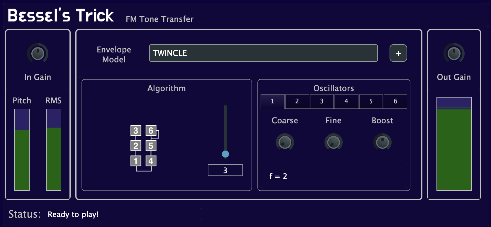

Explanation, what is this?

## Get the Plugin

 - First, choose the package according to your OS.
<table class="center">
<tr>
    <th>
    <a href="/BesselsTrick">macOS ARM</a>
    </th>
    <th>
    <a href="/BesselsTrick">macOS intel</a>
    </th>
    <th>
    <a href="/BesselsTrick">Debian</a>
    </th>
</tr>

</table>

- Next, <a href="/BesselsTrick"><b>Download the Pretrained Models</b></a>

## How to use?
Explain open where the VST can see it, provide multiple instructions to other webpages
Explaiun download the pretrained models and open them on the plugin, each model is a sound

## Contact

