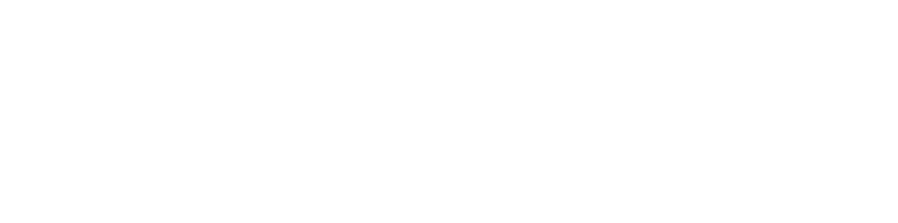

<html lang="en">
<head>
    <meta charset="UTF-8">
    <meta name="viewport" content="width=device-width, initial-scale=1.0">
    <title>BRAVE Plugin</title>
    <link rel="icon" href="../assets/braveplugin/brave_logo_transparent.png" type="image/png">

    <link rel="preconnect" href="https://fonts.googleapis.com">
    <link rel="preconnect" href="https://fonts.gstatic.com" crossorigin>
    <link href="https://fonts.googleapis.com/css2?family=Inter:wght@300;400;600;700&display=swap" rel="stylesheet">
    
    
    <link href="https://cdn.jsdelivr.net/npm/remixicon@4.2.0/fonts/remixicon.css" rel="stylesheet">

    
</head>
<body>

    <header class="hero-section">
        
        <h1>BRAVE Plugin</h1>
        
Reimagining Live Instrumental Performance.

        

            <a href="/BravePlugin2/#get-the-plugin--pretrained-models" class="button"><i class="ri-download-fill"></i> Get the Plugin</a>
            <a href="https://github.com/fcaspe/BRAVE" class="button" target="_blank" rel="noopener noreferrer"><i class="ri-github-fill"></i> Training Code</a>
        

    </header>

    

        
<strong><i class="ri-feedback-fill"></i> Help us improve BRAVE!</strong> Share your experience in our quick survey. <a href="https://example.com/your-survey-link" class="button" target="_blank" rel="noopener noreferrer"
               onclick="gtag('event', 'click', {
                 'event_category': 'Survey CTA Top Banner',
                 'event_label': 'Take Survey Button Top'
               });">
               <i class="ri-survey-line"></i> Take the Survey
            </a>

    

    

        <h2>Unlock Your Creative Sound</h2>
        

            

                Whether you sing or play an instrument, BRAVE empowers your artistic expression.
            

            

                Explore new sonic possibilities, expand your musical palette, and bring fresh ideas to life with your instrument, augmented by intuitive, malleable, and expressive controls.
            

        

    

    

        <h2><i class="ri-play-circle-fill"></i> See BRAVE in Action</h2>
        

            

                
Play it Live!

                

                    <iframe src="https://www.youtube.com/embed/REJNKux2mzk" frameborder="0" allow="accelerometer; autoplay; clipboard-write; encrypted-media; gyroscope; picture-in-picture" allowfullscreen title="BRAVE Plugin Live Performance Demonstration"></iframe>
                

            

            

                
Percussive augmentation

                

                    <iframe src="https://www.youtube.com/embed/CyBBOowaKqU" frameborder="0" allow="accelerometer; autoplay; clipboard-write; encrypted-media; gyroscope; picture-in-picture" allowfullscreen title="BRAVE Plugin Percussive Augmentation Demo"></iframe>
                

            

            

                
Beatboxing

                

                    <iframe src="https://www.youtube.com/embed/J74Q5cVDZx4" frameborder="0" allow="accelerometer; autoplay; clipboard-write; encrypted-media; gyroscope; picture-in-picture" allowfullscreen title="BRAVE Plugin Beatboxing Performance"></iframe>
                

            

            

                
Instrument retargeting

                

                    <iframe src="https://www.youtube.com/embed/X9vOlyE8eRg" frameborder="0" allow="accelerometer; autoplay; clipboard-write; encrypted-media; gyroscope; picture-in-picture" allowfullscreen title="BRAVE Plugin Instrument Retargeting Example"></iframe>
                

            

        

    

    

        <h2>Get the Plugin & Pretrained Models</h2>
        
Download the latest version for macOS Apple Silicon and the essential pretrained models to get started.

        

            <a href="https://github.com/fcaspe/BraveDemoPluginReleases/releases/download/v1.0.0/BraveDemoPlugin.zip"
               class="button"
               onclick="gtag('event', 'download', {
                 'event_category': 'Plugin Downloads',
                 'event_label': 'MacOS ARM64',
                 'event_action': 'BravePlugin v1.0.0'
               });">
               <i class="ri-download-fill"></i> Download Plugin (macOS Apple Silicon)
            </a>

            <a href="https://github.com/fcaspe/BraveDemoPluginReleases/releases/download/v1.0.0/pretrained.zip"
               class="button"
               onclick="gtag('event', 'download', {
                 'event_category': 'Model Downloads',
                 'event_label': 'Pretrained Models',
                 'event_action': 'BRAVE Pretrained'
               });">
               <i class="ri-folder-zip-fill"></i> Download Pretrained Models
            </a>
        

        
Plugin notarized by Apple - Latest update: `6/3/25 - Version 1.0`

        
Note: This plugin is currently in beta testing, and there may be bugs or unexpected behavior. Your feedback is appreciated to help improve future versions. If you encounter any issues, please contact us.

    

    

        

            <h3><i class="ri-book-read-fill"></i> Instructions</h3>
            
Use your preferred DAW (Digital Audio Workstation), that supports VST3 or AU plugin formats. Each <strong>pretrained model</strong> implements a new sound you can control with your instrument.

            <ol>
                <li>Download the plugin to a directory where your <a href="https://higherhz.com/adding-a-new-vst-synth-plugin-to-reaper/" target="_blank" rel="noopener noreferrer">DAW can see it</a>.</li>
                <li>Download and uncompress the pretrained models.</li>
                <li>Open the plugin at your DAW, and select the folder where you stored the models.</li>
                <li><strong>Done!</strong> The models can now be selected from the GUI's list.</li>
            </ol>
        

    

    

        

            <h3><i class="ri-folder-open-fill"></i> Pretrained models</h3>
            
The provided models are trained from openly available datasets.

            <table class="model-table">
                <thead>
                    <tr>
                        <th>Model</th>
                        <th>Dataset Description</th>
                    </tr>
                </thead>
                <tbody>
                    <tr>
                        <td><strong>birdsong.h5</strong></td>
                        <td><a href="https://www.kaggle.com/datasets/rtatman/british-birdsong-dataset" target="_blank" rel="noopener noreferrer">British Birdsong Dataset</a>, gathered from the <a href="http://www.xeno-canto.org/" target="_blank" rel="noopener noreferrer">Xeno Canto collection</a>.</td>
                    </tr>
                    <tr>
                        <td><strong>candombe.h5</strong></td>
                        <td><a href="https://zenodo.org/records/6533068" target="_blank" rel="noopener noreferrer">Uruguayan candombe drumming</a> dataset.</td>
                    </tr>
                    <tr>
                        <td><strong>drumset.h5</strong></td>
                        <td><a href="https://magenta.tensorflow.org/datasets/e-gmd" target="_blank" rel="noopener noreferrer">The Expanded Groove MIDI Dataset</a>. 2h 50m of a drummer performing on an electronic drum kit.</td>
                    </tr>
                    <tr>
                        <td><strong>filosax.h5</strong></td>
                        <td>Trained using recordings of <em>Participant 1</em> from the <a href="https://dave-foster.github.io/filosax/" target="_blank" rel="noopener noreferrer">Filosax Dataset</a>.</td>
                </tr>
            </tbody>
        </table>
            
Check <a href="https://github.com/fcaspe/BRAVE" target="_blank" rel="noopener noreferrer">BRAVE's Repo</a> for instructions on how to train your own models. <a href="https://docs.google.com/forms/d/1nB1DjQSS-S3RNT1TiE_z2SoBZPDdIY2svXx1yg-z2fY" target="_blank" rel="noopener noreferrer">Contact Me</a> if you would like to submit new models to the pretrained pack.

        

    

    

        

            <h3><i class="ri-question-answer-fill"></i> Contact</h3>
            
If you want to know more, stay up to date on this project, report a bug, or have any feedback, please contact us.

            <a href="https://docs.google.com/forms/d/1nB1DjQSS-S3RNT1TiE_z2SoBZPDdIY2svXx1yg-z2fY" class="button" target="_blank" rel="noopener noreferrer">
               <i class="ri-mail-fill"></i> Contact Form
            </a>
        

    

    <footer class="site-footer">
        
© 2025 <a href="https://fcaspe.github.io">Franco Caspe</a>. All rights reserved.

    </footer>

</body>
</html>