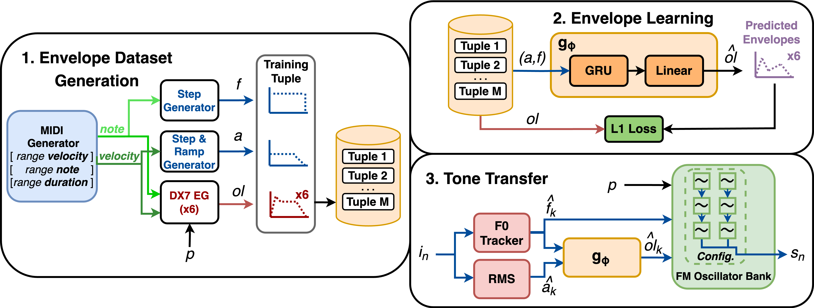
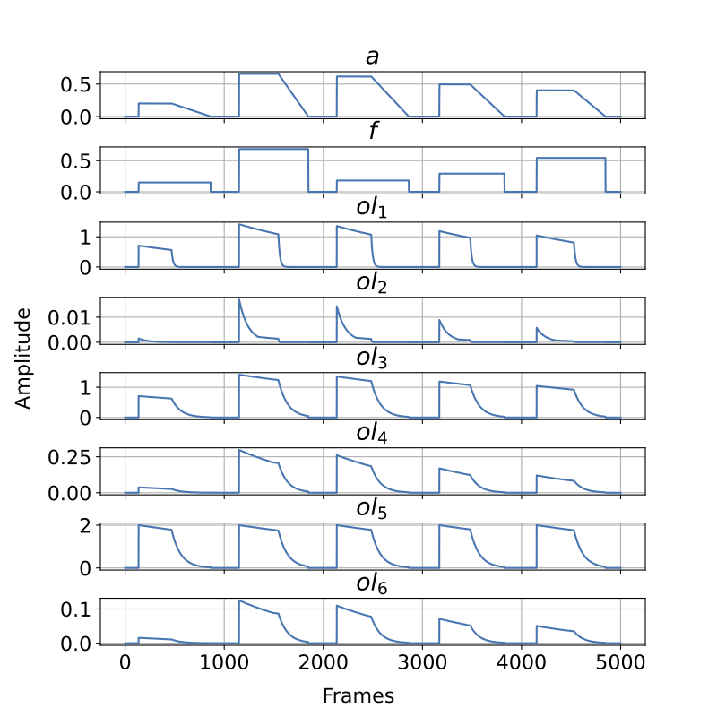

&nbsp;

<b>FM Tone Transfer with Envelope Learning</b> 
<b>Franco Caspe - Andrew McPherson - Mark Sandler</b> 
Queen Mary University of London - Centre for Digital Music 
<b><a href="/assets/pdf/learned_envelopes.pdf" target="_blank">Paper</a> - <a href="https://github.com/fcaspe/fmtransfer" target="_blank">Code</a> - 
<a href="https://www.dropbox.com/s/pkzpy4t0vkkjik5/FM%20Tone%20Transfer.mp4?dl=0" target="_blank">Demo Video</a>
</b>
 

<h2>Abstract</h2>

Tone Transfer is a novel deep-learning technique for interfacing a sound source with a synthesizer, transforming the timbre of audio excerpts while keeping their musical form content. Due to its good audio quality results and continuous controllability, it has been recently applied in several audio processing tools. Nevertheless, it still presents several shortcomings related to poor sound diversity, and limited transient and dynamic rendering, which we believe hinder its possibilities of articulation and phrasing in a real-time performance context.

In this work, we present a discussion on current Tone Transfer architectures for the task of controlling synthetic audio with musical instruments and discuss their challenges in allowing expressive performances.
Next, we introduce Envelope Learning, a novel method for 
designing Tone Transfer architectures that map musical events using a training objective at the synthesis parameter level. Our technique can render note beginnings and endings accurately and for a variety of sounds; these are essential steps for improving musical articulation, phrasing, and sound diversity with Tone Transfer.
Finally, we implement a VST plugin for real-time live use and discuss possibilities for improvement.

## Method

1. **Envelope Dataset Generation:** we create a synthetic dataset of aligned sequences (𝑎, 𝑓 , 𝑜𝑙). 𝑎 and 𝑓
model the frame-wise amplitude and 𝐹0 trajectories of a monophonic audio signal, while 𝑜𝑙 are the oscillator output levels of an FM synthesizer programmed with a patch 𝑝.  

2. **Envelope Learning:** we train a Recurrent Neural Network model 𝑔() to learn the correspondences
between the features 𝑎, 𝑓 and the controls 𝑜𝑙 reflected in the dataset. 

3. **FM Tone Transfer:** we deploy the RNN into a Tone Transfer pipeline. In
this context, it processes frame-wise input features from real audio 𝑖𝑛, and controls the envelopes of an FM oscillator bank configured according to the patch 𝑝.

## The Envelopes

Our approach employs a *generic* excitation model, defined by a step response and linear decay in energy (𝑎), and a step function in frequency (𝑓) to use as conditioning signals during training.

The training tasks consists of reconstructing the temporal envelope sequence 𝑜𝑙 of different synthesizer patches from the pair of generic excitation signals 𝑎 and 𝑓.

&nbsp;Excerpt from an envelope dataset extracted from the E.PIANO 1 patch.

## Audio examples

We show that our model can reconstruct the oscillator envelopes and synthesize high fidelity audio with them.

 
<table>
  <tr>
    <th>
Patch
</th>
    <th>
Original
</th>
    <th>
Reconstructed
</th>
  </tr>
  <tr>
    <td><b>E. PIANO 1</b> &nbsp;</td>
    <td>
    <audio controls>
    <source src="../assets/fmtransfer/examples/EPIANO_ref.wav" type="audio/mpeg">
    <source src="../assets/fmtransfer/examples/EPIANO_ref.wav" type="audio/ogg">
    Your browser does not support the audio element.
    </audio>
     &nbsp;
    </td>
    <td>
    <audio controls>
    <source src="../assets/fmtransfer/examples/EPIANO_pred.wav"  type="audio/mpeg">
    <source src="../assets/fmtransfer/examples/EPIANO_pred.wav"  type="audio/ogg">
    Your browser does not support the audio element.
    </audio>
     &nbsp;
    </td>
  </tr>
    <tr>
    <td><b>BRASS 3</b> &nbsp;</td>
    <td>
    <audio controls>
    <source src="../assets/fmtransfer/examples/BRASS_ref.wav" type="audio/mpeg">
    <source src="../assets/fmtransfer/examples/BRASS_ref.wav" type="audio/ogg">
    Your browser does not support the audio element.
    </audio>
     &nbsp;
    </td>
    <td>
    <audio controls>
    <source src="../assets/fmtransfer/examples/BRASS_pred.wav" type="audio/mpeg">
    <source src="../assets/fmtransfer/examples/BRASS_pred.wav" type="audio/ogg">
    Your browser does not support the audio element.
    </audio>
     &nbsp;
    </td>
  </tr>
    <tr>
    <td><b>MARIMBA</b> &nbsp;</td>
    <td>
    <audio controls>
    <source src="../assets/fmtransfer/examples/MARIMBA_ref.wav" type="audio/mpeg">
    <source src="../assets/fmtransfer/examples/MARIMBA_ref.wav" type="audio/ogg">
    Your browser does not support the audio element.
    </audio>
     &nbsp;
    </td>
    <td>
    <audio controls>
    <source src="../assets/fmtransfer/examples/MARIMBA_pred.wav" type="audio/mpeg">
    <source src="../assets/fmtransfer/examples/MARIMBA_pred.wav" type="audio/ogg">
    Your browser does not support the audio element.
    </audio>
     &nbsp;
    </td>
  </tr>
  </table>
