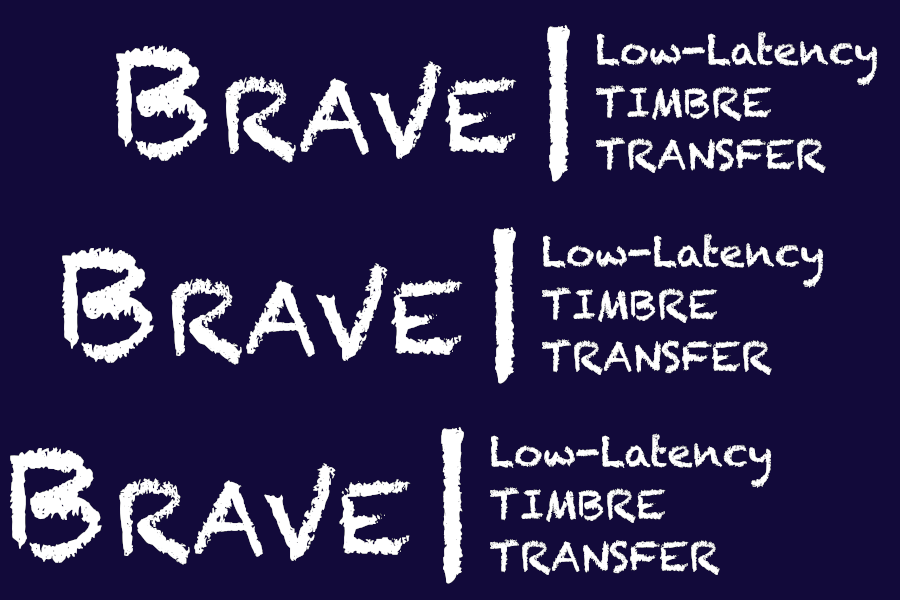
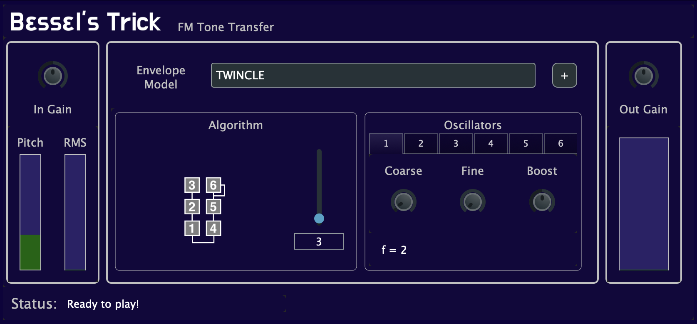

# My Projects
-------

### BRAVE Demo Plugin
*Real-time Low-latency Timbre Transfer with Waveform Autoencoders*.  
<b><a href="/BravePlugin">Website</a></b> - <b><a href="https://www.youtube.com/watch?v=REJNKux2mzk">Demo Video</a></b>

-------

### Bessel's Trick
*FM Tone Transfer plugin for real-time performances!*.  
<b><a href="/BesselsTrick">Website</a></b>   - <b><a href="https://youtu.be/-Po4Y1WtoBs">Demo Video</a></b>  

-------

### 40k On The Floor
*Re-imagined barrel organ for electronic music live performances*.  
<i>Presented at the Synthlux Hackaton 2023</i>  
<b><a href="https://www.synthux.academy/project/40k-on-the-floor">Website</a></b> - <b><a href="https://www.youtube.com/watch?v=Qg-__b-Iu7M">Demo Video</a></b>

-------
### DDSP in VCVRack
*Neural Synthesizer for virtual Eurorack*  
<i>Presented at NASH, the Neural Audio Synthesis Hackathon</i>  
<b><a href="https://github.com/tonetechnician/neural-vcv-synths">GitHub</a></b>

-------

### bFreeOrgan2  
*Open Source Additive Synthesizer for Cortex M4.*  
<b><a href="https://github.com/fcaspe/bfreeOrgan2">GitHub</a></b> - 
<b><a href="https://www.youtube.com/watch?v=1dnvwjrLUrQ">Demo Video</a></b>

-------

### Master's Thesis: Efficient DNN Serving
*Inference efficiency with FPGAs (Erasmus Mundus MsC)*  
<b><a href="/assets/pubs/Efficient_DNN_Serving.pdf">Msc Thesis PDF</a></b>  

-------

### Binary Neural Networks for FPGAs
*Extremely Fast - Extremely quantized.*  
<b><a href="/deep%20learning/fpga_BNN/">Post</a></b>  

-------

### dx7pytorch
*Musical instrument dataset synthesized on-the-fly.*  
<b><a href="https://github.com/fcaspe/dx7pytorch">GitHub</a></b>  

