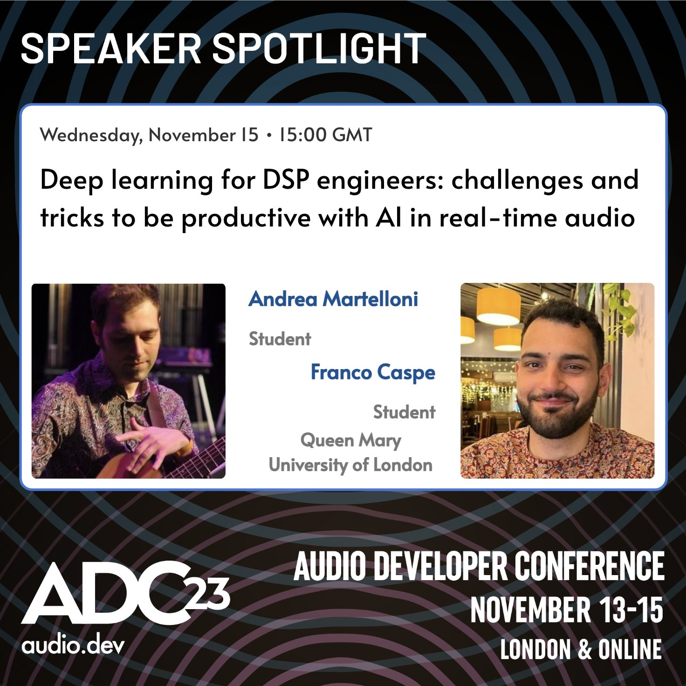

## Talks and Presentations

    <a href="https://www.youtube.com/watch?v=LaGFZBucAVM" class="project-card-link">
        

            

                
            

            

                <h3>Real-time Neural Audio: Design and Inference Workshop</h3>
                
A tutorial on neural networks for audio processing, covering design, latency, streaming architectures, and the RT Neural framework.

                

                    Video Link
                

            

        

    </a>

    <a href="https://www.youtube.com/watch?v=mFuvUfFJ1uo" class="project-card-link">
        

            

                
            

            

                <h3>Deep Learning for DSP Engineers: Challenges & Tricks for Audio AI</h3>
                
A presentation at ADC23 focused on making deep learning more approachable for DSP Engineers, with an emphasis on real-time music audio applications.

                

                    Video Link
                

            

        

    </a>

    <a href="https://www.youtube.com/watch?v=-Po4Y1WtoBs" class="project-card-link">
        

            

                
            

            

                <h3>Bessel's Trick: A Neural FM Synthesis Plugin</h3>
                
A demonstration of Bessel's Trick, an audio plugin that uses very small neural networks and FM synthesis for real-time tone transformation.

                

                    Video Link
                

            

        

    </a>

    <a href="https://www.youtube.com/watch?v=Xb7Q3tk79JI" class="project-card-link">
        

            

                
            

            

                <h3>Embedded AI Workshop @ NIME 2022</h3>
                
This session includes the "REAL-TIME FM Tone Transfer with BELA" presentation, detailing the implementation of low-latency FM tone transfer on the Bela embedded platform.

                

                    Video Link
                

            

        

    </a>
    
    <a href="https://www.youtube.com/watch?v=hxlgO3EWVYI" class="project-card-link">
        

            

                
            

            

                <h3>DDX7 @ MILA Reading Group</h3>
                
A presentation at the MILA Reading Group discussing my paper DDX7.

                

                    Video Link
                

            

        

    </a>

